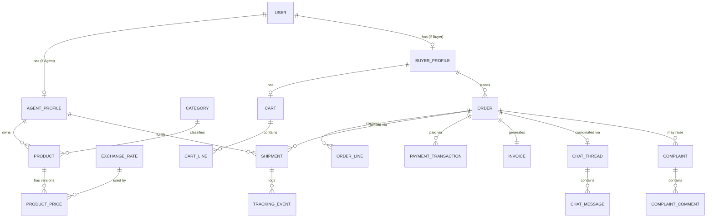

# Linkano Marketplace — Domain Model

This document defines the domain entities, aggregates, value objects and relationships that implement `business.md` and `business-rules.md`. It is written in Domain-Driven Design (DDD) terms and is the direct input to `database-design.md` (persistence mapping) and the Clean Architecture `Domain` layer described in `architecture.md`.

## 1. Bounded Contexts

The domain is split into bounded contexts to keep the model coherent and to anticipate future service extraction (see `architecture.md §Future Scalability`).

| Bounded Context | Responsibility |
|---|---|
| **Identity & Access** | Users, roles, authentication, agent verification. |
| **Catalog** | Products, categories, approval workflow. |
| **Pricing** | Price calculation, exchange rates, cost components, price history. |
| **Ordering** | Cart, Orders, Order Lines, Shipments, state machine. |
| **Payments** | Payment transactions, invoices, reconciliation. |
| **Logistics & Tracking** | Tracking events, customs clearance, delivery. |
| **Communication** | Chat threads, messages, admin supervision. |
| **Support** | Complaints, disputes, reports. |
| **Analytics** | Read-model aggregates for reporting (derived, not a source of truth). |

Contexts communicate via well-defined application services / domain events in-process for MVP (modular monolith — see `architecture.md`), with explicit anti-corruption boundaries so each context could later be extracted into its own service.

## 2. Aggregates & Entities

### 2.1 Identity & Access Context

**`User`** (aggregate root)
- `Id` (Guid)
- `Email`, `PhoneNumber`, `PasswordHash`
- `Role` (`Buyer` | `Agent` | `Admin` | `SuperAdmin`)
- `FullName`, `CompanyName` (nullable for Buyer individuals)
- `Status` (`Active`, `Suspended`, `PendingVerification`)
- `CreatedAt`, `UpdatedAt`

**`AgentProfile`** (1:1 with `User` where `Role = Agent`)
- `UserId` (FK)
- `CompanyLegalName`, `CountryOfOperation` (e.g., China)
- `ApprovalStatus` (`PendingReview`, `Approved`, `Rejected`, `Suspended`)
- `RejectionReason` (nullable)
- Collection of `AgentVerificationDocument` (entity: `DocumentType`, `FileUrl`, `UploadedAt`, `ReviewedBy`, `ReviewStatus`)
- `ApprovedAt`, `ApprovedByUserId`

**`BuyerProfile`** (1:1 with `User` where `Role = Buyer`)
- `UserId` (FK)
- `CompanyName` (nullable), `TaxId` (NUIT, nullable), `DefaultShippingAddress`

> Design note: `AgentProfile`/`BuyerProfile` are separate entities rather than nullable columns on `User`, to keep `User` role-agnostic and avoid a wide, mostly-null table (see `database-design.md §Naming & Modeling Conventions`).

### 2.2 Catalog Context

**`Category`** (aggregate root)
- `Id`, `Name`, `Slug`, `ParentCategoryId` (nullable, self-referencing for subcategories), `IconUrl`

**`Product`** (aggregate root)
- `Id`, `AgentId` (FK → AgentProfile), `CategoryId` (FK)
- `Title`, `Description`, `Specifications` (structured key/value collection or JSON, TBD in impl.)
- `Images` (collection of `ProductImage`: `Url`, `SortOrder`)
- `MinimumOrderQuantity` (default 1)
- `Status` (`Draft`, `Submitted`, `UnderReview`, `Approved`, `Rejected`, `Published`, `Unpublished`)
- `RejectionReason` (nullable)
- `CurrentPriceId` (FK → `ProductPrice`, nullable until first price approved)
- `CreatedAt`, `UpdatedAt`, `PublishedAt`

**Invariants (enforced in aggregate, not just DB constraints):**
- Cannot transition to `Published` without a non-null `CurrentPriceId` referencing an `Approved` `ProductPrice`.
- Cannot transition to `Submitted` unless owning Agent's `ApprovalStatus = Approved`.
- Any mutation to content fields while `Published` forces transition to `UnderReview` (BR-PRD-04).

### 2.3 Pricing Context

**`ExchangeRate`** (aggregate root, append-only)
- `Id`, `BaseCurrency` (e.g., USD), `QuoteCurrency` (MZN), `Rate`, `EffectiveAt`, `Source` (manual/API), `CreatedByUserId` (nullable if system-fed)

**`ProductPrice`** (aggregate root, append-only/versioned — one row per calculation, never mutated)
- `Id`, `ProductId` (FK)
- Component amounts (all `decimal`, all in a declared calculation currency, typically USD, plus final MZN output): `SupplierCost`, `Freight`, `CbmAllocation`, `PreShippingCosts`, `OperationalCosts`, `Insurance` (nullable), `RoseairCommission`
- `ExchangeRateId` (FK — the rate used for this calculation)
- `MarketplacePrice` (computed, MZN, persisted for query performance)
- `Status` (`PendingApproval`, `Approved`, `Rejected`, `Superseded`)
- `ApprovedByUserId`, `ApprovedAt`, `RejectionReason`
- `CreatedAt`

See `pricing-engine.md` for the full computation and recalculation algorithm.

### 2.4 Ordering Context

**`Cart`** (aggregate root, ephemeral, 1:1 with Buyer)
- `Id`, `BuyerId`, collection of `CartLine` (`ProductId`, `Quantity`, `UnitPriceSnapshot` — informational only, re-validated at checkout per BR-PRD-09)

**`Order`** (aggregate root)
- `Id`, `OrderNumber` (human-readable), `BuyerId`
- `Status` (`PendingPayment`, `PaymentConfirmed`, `PreparingShipment`, `Shipped`, `TrackingActive`, `ArrivedAtPort`, `CustomsClearance`, `Delivered`, `Cancelled`) — see `database-design.md` for how `Disputed` is modeled as a flag, not a status value (BR-ORD-03)
- `IsDisputed` (bool)
- `TotalAmount` (MZN, snapshot sum of order lines at confirmed price)
- `ShippingAddress` (value object)
- `CreatedAt`, `PaymentConfirmedAt`, `DeliveredAt` (nullable milestones)
- Collection of `OrderLine` (entity: `ProductId`, `AgentId`, `Quantity`, `UnitPriceSnapshot` — the immutable price at purchase time per BR-PRC-05, `LineTotal`)
- Collection of `Shipment` (see below) — one per distinct Agent represented in the order lines (BR-ORD-04)

**`Shipment`** (entity within `Order` aggregate, or its own aggregate referencing `OrderId` — recommended as its own aggregate for independent lifecycle/concurrency, referenced by `OrderId` + `AgentId`)
- `Id`, `OrderId`, `AgentId`
- `Status` (mirrors the relevant subset of Order lifecycle: `PreparingShipment` → `Shipped` → `TrackingActive` → `ArrivedAtPort` → `CustomsClearance` → `Delivered`)
- `TrackingNumber` (nullable until `Shipped`)
- `Carrier` (nullable)
- Collection of `TrackingEvent` (`Status`, `Location` (nullable), `Note` (nullable), `OccurredAt`)

**Order aggregate invariants:**
- `Order.Status` is derived as the minimum (least-advanced) status across child `Shipment`s once `PaymentConfirmed` (BR-ORD-04); before that, `Order.Status = PendingPayment` and no Shipments exist yet.
- Status transitions strictly forward per BR-ORD-01, enforced by a guard function shared by `Order` and `Shipment`.

### 2.5 Payments Context

**`PaymentTransaction`** (aggregate root)
- `Id`, `OrderId` (FK), `Method` (`MPesa`, `EMola`, `BankTransfer`, extensible enum/lookup)
- `Amount`, `Currency`
- `Status` (`Initiated`, `Pending`, `Confirmed`, `Failed`, `RequiresManualReview` — used for Bank Transfer per BR-PAY-05)
- `ExternalReference` (gateway transaction id, nullable)
- `ProofOfPaymentUrl` (nullable, Bank Transfer)
- `ReconciledByUserId`, `ReconciledAt` (nullable, manual confirmations)
- `CreatedAt`, `ConfirmedAt`

**`Invoice`** (aggregate root)
- `Id`, `InvoiceNumber`, `OrderId` (FK)
- `Status` (`ProForma`, `Finalized`)
- `IssuedAt`, `FinalizedAt`
- Snapshot of line items and totals (denormalized copy of Order lines at issue time, since Order lines are already immutable post-purchase, but Invoice is the legal/document representation and must survive even if internal Order modeling evolves)

### 2.6 Logistics & Tracking Context
Modeled primarily via `Shipment`/`TrackingEvent` above (kept in Ordering context since Shipment's lifecycle is intrinsically order-bound). Customs Clearance is represented as a `TrackingEvent`/`Shipment.Status` value plus an optional `CustomsClearance` detail entity for documentation references (`DocumentUrl`, `ClearedByUserId`, `ClearedAt`) — Phase 2+ if more structure is needed.

### 2.7 Communication Context

**`ChatThread`** (aggregate root)
- `Id`, `OrderId` (FK, nullable-until-created-at-PaymentConfirmed per BR-CHT-01), `BuyerId`, `AgentId`
- `CreatedAt`, `Status` (`Active`, `Closed`)

**`ChatMessage`** (entity within `ChatThread`)
- `Id`, `ThreadId`, `SenderUserId`, `Body`, `Attachments` (collection of URLs), `SentAt`, `ReadAt` (nullable, per recipient — may need a join entity `ChatMessageRead` for multi-reader (Admin) support)

Admin visibility is a **query-time authorization rule**, not a data-modeling concern — Admins query all `ChatThread`/`ChatMessage` rows by role, no special schema needed (BR-CHT-02).

### 2.8 Support Context

**`Complaint`** (aggregate root)
- `Id`, `OrderId` (FK), `RaisedByUserId`, `Type` (`Complaint`, `Dispute`, `Report`)
- `Subject`, `Description`
- `Status` (`Open`, `InReview`, `Resolved`, `Rejected`)
- `ResolutionNote` (nullable), `ResolvedByUserId`, `ResolvedAt`
- Collection of `ComplaintComment` (`AuthorUserId`, `Body`, `Attachments`, `CreatedAt`)

### 2.9 Analytics Context
No independent aggregates; this context consumes domain events / read replicas from the other contexts to build reporting projections (see `system-design.md §Module Interactions` and `architecture.md §CQRS Readiness`). Conceptually: `DailySalesSnapshot`, `AgentPerformanceSnapshot`, `ProductPerformanceSnapshot`, `TrafficSnapshot` — all derived/materialized, never a write target from user actions directly.

## 3. Aggregate Relationship Diagram

## 4. Value Objects

- `Money` (`Amount: decimal`, `Currency: string ISO-4217`)
- `Address` (`Street`, `City`, `Province`, `Country`, `PostalCode?`)
- `PriceComponents` (used internally by the Pricing Engine before persistence — see `pricing-engine.md`)

## 5. Domain Events (indicative, for future event-driven expansion)

- `AgentApproved`, `AgentSuspended`
- `ProductSubmitted`, `ProductApproved`, `ProductPublished`, `ProductPriceChanged`
- `OrderPlaced`, `PaymentConfirmed`, `OrderStatusChanged`, `OrderDisputed`
- `ShipmentTrackingUpdated`
- `ComplaintRaised`, `ComplaintResolved`
- `ChatMessageSent`

These events are the seam for Analytics projections, notifications, and future service extraction (see `architecture.md §Future Integrations`).

## 6. Non-Goals for This Model (MVP)

- No multi-tenant "Organization" entity (Phase 4, BR-FUT-05).
- No Agent payout ledger entity (Phase 3, BR-FUT-04).
- No automated chat moderation entities (Phase 3, BR-FUT-02).
