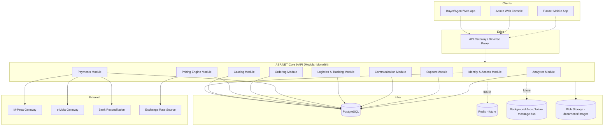
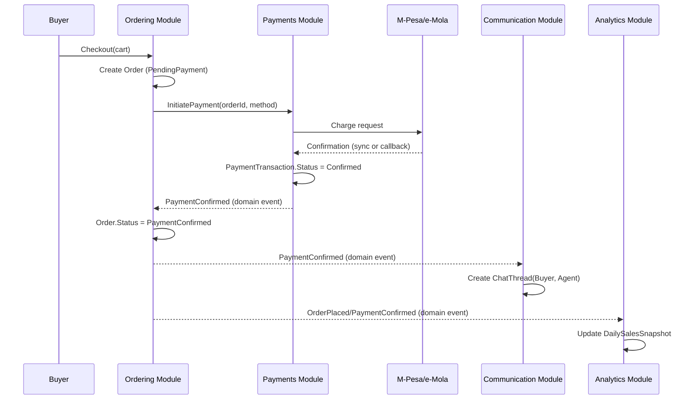
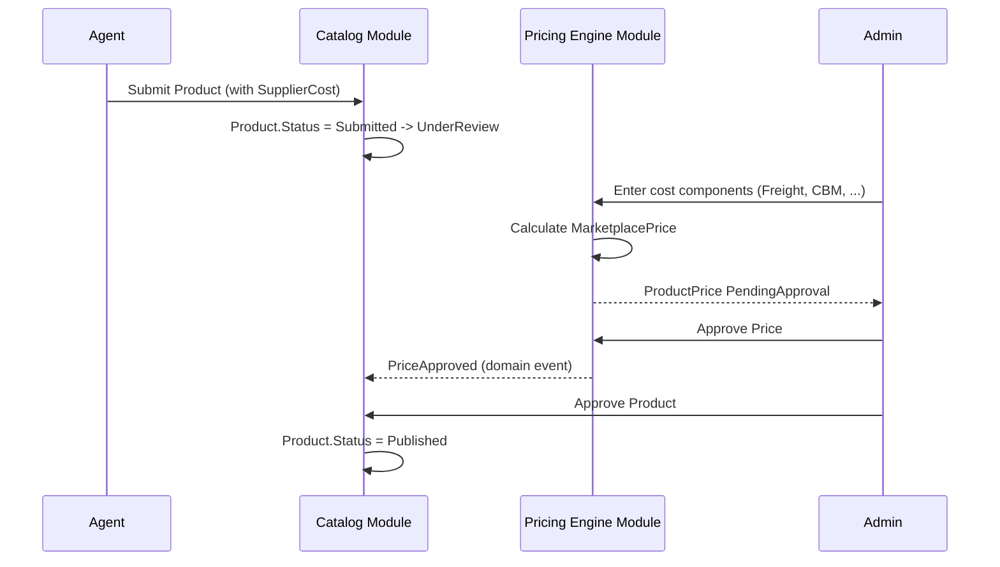
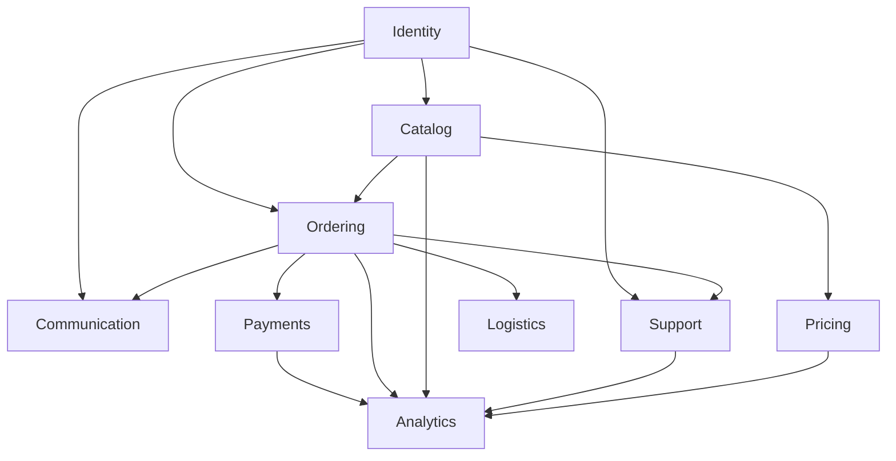

# Roseair Marketplace — System Design

## 1. High-Level Architecture

Roseair Marketplace is delivered as a **modular monolith** on ASP.NET Core 9, organized by bounded context (`domain-model.md §1`), deployed as a single API service in MVP with clear internal module boundaries that allow future extraction into independently deployable services (Pricing Engine and Analytics are the most likely first candidates — see §5).

## 2. Layer Responsibilities

Each module internally follows Clean Architecture layering (fully detailed in `architecture.md`):

| Layer | Responsibility |
|---|---|
| **Domain** | Entities, aggregates, value objects, domain events, invariants. No dependency on anything else. |
| **Application** | Use cases (commands/queries), orchestration, authorization policy evaluation, DTOs, validation entry points. Depends only on Domain (+ abstractions it defines for infrastructure). |
| **Infrastructure** | EF Core persistence, external gateway clients (M-Pesa, e-Mola), file storage, background job execution. Implements Application-defined interfaces. |
| **API (Presentation)** | Controllers/endpoints, request/response DTOs, authentication middleware, Swagger, error mapping. Depends on Application only. |

## 3. Module Interactions

Modules communicate primarily through:
1. **Direct in-process calls** to Application-layer use cases exposed by another module's public interface (not by reaching into another module's Domain/Infrastructure).
2. **Domain events** (in-process mediator, e.g., MediatR notifications) for cross-cutting reactions that shouldn't couple the originating module to the consumer — e.g., `PaymentConfirmed` → Ordering module reacts (advance Order), Communication module reacts (create ChatThread per BR-CHT-01), Analytics module reacts (update snapshot).

## 4. Domain Boundaries

See `domain-model.md §1` for the authoritative bounded-context list. The rule governing all module design: **a module may depend on another module's published Application-layer contracts, never on its Domain or Infrastructure internals.** This is enforced architecturally via project references (`architecture.md §Dependency Rules`) and, pragmatically, by code review discipline in the modular-monolith phase (no build-time enforcement tool mandated in MVP, but ArchUnit-style tests are a Phase 2 candidate).

## 5. Future Scalability

The modular monolith is deliberately structured so that the following modules can be extracted into independent services without a domain redesign, in priority order of likely need:

1. **Pricing Engine** — highest computational/scheduling load (FX-triggered recalculation sweeps across the catalog); clean input/output boundary; could become an internal service invoked by Catalog.
2. **Analytics** — naturally a read-model/reporting service consuming events; benefits from independent scaling and possibly a different storage technology (e.g., a columnar store) as volume grows.
3. **Communication (Chat)** — real-time messaging benefits from a dedicated SignalR-backed service and independent scaling once concurrent chat volume is meaningful.
4. **Payments** — isolating payment-gateway integration reduces blast radius of PCI/financial-compliance concerns as the platform matures.

Extraction path: each module's Application-layer contracts become the service's public API surface (REST/gRPC); domain events become messages on a broker (e.g., RabbitMQ/Azure Service Bus) instead of in-process notifications. No domain model changes are anticipated at extraction time if the module boundaries above are respected from day one.

## 6. Module Dependency Diagram

Arrows indicate "depends on published contracts of" — dependencies flow one direction to avoid cycles; `Analytics` has no outbound dependencies (pure consumer via events), keeping it safe to extract first if reporting load ever requires it ahead of Pricing.

## 7. Related Documents

- `architecture.md` — internal Clean Architecture layering, folder structure, cross-cutting strategies.
- `domain-model.md` — entities/aggregates behind each module.
- `api-design.md` — external API surface.
- `database-design.md` — persistence design.
