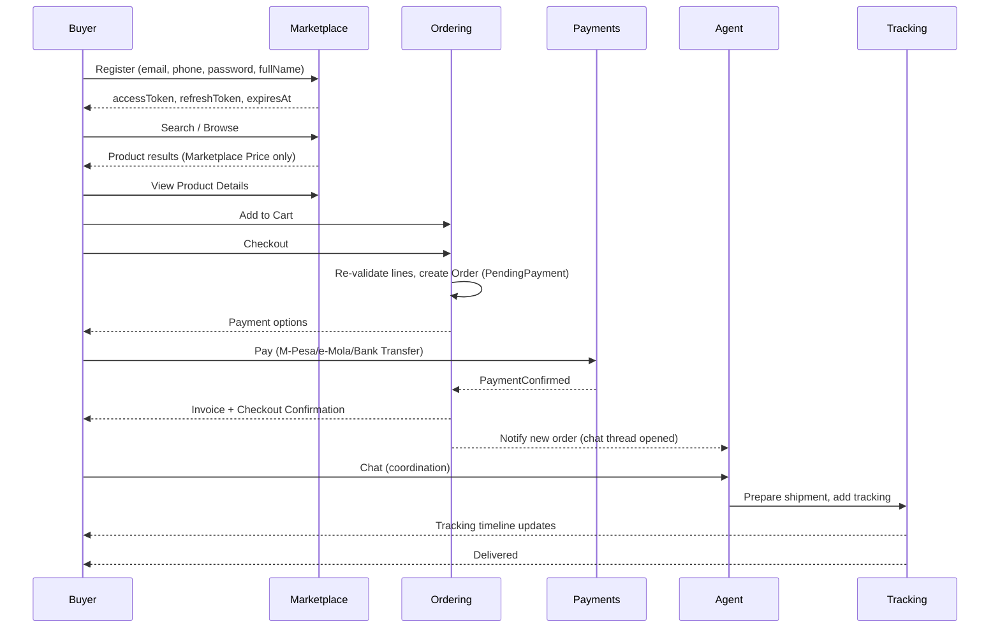

# Linkano Marketplace — User Flows

This document walks through the primary end-to-end flows referenced across `business.md`, `business-rules.md`, and `modules.md`, at the level of screens/actions and system reactions.

## 1. Buyer: Registration → Browse → Purchase → Delivery

```
1. Buyer registers (email, phoneNumber, password, fullName, optional companyName)
2. System creates User (Role = Buyer) + BuyerProfile in single transaction
3. Password hashed; authentication tokens returned immediately (no email verification in MVP)
4. Buyer lands on Marketplace homepage (search-first, category nav, product cards)
5. Buyer searches/filters → Product List
6. Buyer opens Product Details (Marketplace Price shown; no raw supplier cost anywhere)
7. Buyer adds to Cart (optionally from multiple Agents)
8. Buyer proceeds to Checkout
     -> System re-validates each cart line: product still Published, price still current (BR-PRD-09)
     -> Order created, Status = PendingPayment
9. Buyer selects Payment Method (M-Pesa / e-Mola / Bank Transfer)
     -> M-Pesa/e-Mola: redirected/prompted to gateway, near-real-time confirmation
     -> Bank Transfer: Buyer uploads proof of payment, Status = PendingPayment (awaiting manual reconciliation)
10. Payment Confirmed -> Order.Status = PaymentConfirmed
      -> Invoice finalized
      -> Checkout Confirmation screen shown to Buyer
      -> ChatThread(s) auto-created per fulfilling Agent (BR-CHT-01)
11. Buyer coordinates via Chat with Agent(s) (Roseair supervises, read-all)
12. Agent prepares shipment -> Order/Shipment.Status = PreparingShipment -> Shipped
13. Buyer views Tracking (TrackingActive -> ArrivedAtPort -> CustomsClearance)
14. Delivery -> Shipment/Order.Status = Delivered
15. Buyer may raise a Complaint against the Order at any point from PaymentConfirmed onward
```



## 2. Agent: Registration → Approval → Selling

```
1. Agent registers (company info + verification documents upload)
2. AgentProfile.ApprovalStatus = PendingReview
3. Admin reviews documents (company existence, market reputation, references, China-market representation)
4. Admin Approves -> AgentProfile.ApprovalStatus = Approved -> Agent notified, can now create/submit products
   OR Admin Rejects (reason required) -> Agent notified, may re-apply
5. Agent creates Product (Draft), enters SupplierCost, submits (Status = Submitted -> UnderReview)
6. Roseair Ops enters remaining price components -> Pricing Engine computes MarketplacePrice (PendingApproval)
7. Admin Approves Price -> Admin Approves Product -> Product.Status = Published
8. Product now purchasable on Marketplace
9. Buyer purchases -> Agent notified of new Order/Shipment
10. Agent coordinates via Chat, prepares and ships product, enters tracking number
```

## 3. Admin: Operational Supervision (composite flow)

```
Daily/ongoing Admin activities:
- Review Agent applications queue
- Review Product submission queue
- Review/approve Price changes (manual + auto-flagged-for-review recalculations)
- Reconcile Bank Transfer payments
- Enter/update Exchange Rates
- Monitor Chat threads (supervisory, ad hoc or flagged)
- Update Tracking events (port arrival, customs clearance, delivery confirmation)
- Handle Order operational exceptions (cancel, dispute flag)
- Review and resolve Complaints/Disputes/Reports
- Monitor Analytics Dashboard (sales, agents, products, traffic, conversion, complaints)
```

## 4. Pricing Recalculation Flow (system-triggered)

```
1. New ExchangeRate entered (manual, Admin) OR scheduled sweep runs
2. Pricing Engine identifies affected Products (current price used the superseded rate)
3. For each Product: recompute MarketplacePrice
4. If delta <= tolerance (default 5%): auto-approve, new price goes live immediately
5. If delta > tolerance: new ProductPrice created as PendingApproval; previous price remains live;
   Admin notified via review queue
6. Admin approves/rejects; on approval, new price becomes Product.CurrentPriceId
```

See `pricing-engine.md §5–6` for full rule detail.

## 5. Complaint / Dispute Flow

```
1. Buyer or Agent raises Complaint against an Order (type: Complaint | Dispute | Report)
2. Complaint.Status = Open; if type = Dispute, Order.IsDisputed = true
3. Admin reviews -> Status = InReview
4. Buyer/Agent may add comments/evidence while Open/InReview
5. Admin resolves -> Status = Resolved (resolution note) or Rejected
6. If Dispute: Order.IsDisputed cleared upon resolution (assumption — cleared, not left true indefinitely)
7. Both parties notified of outcome
```

## 6. Chat Supervision Flow

```
1. ChatThread auto-created at PaymentConfirmed (per Order x Agent pairing)
2. Buyer and Agent exchange messages (specs, shipping instructions, documentation)
3. Every message is simultaneously visible to Admin (query-time authorization, not a separate copy)
4. If Admin observes a policy violation (e.g., off-platform payment solicitation), Admin escalates
   via a Report (Support module) against the offending party — no automated blocking in MVP (BR-CHT-03)
```

## 7. Related Documents

- `business.md §5` — the canonical business flow these diagrams implement.
- `business-rules.md` — the enforceable rules governing each transition above.
- `domain-model.md` — the entities whose state these flows mutate.
- `system-design.md §3` — the technical sequence diagrams for the payment/pricing flows.
